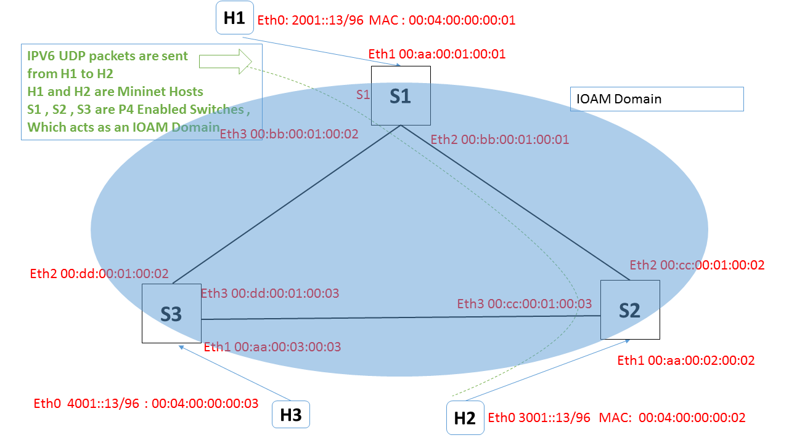

Overview
========
  Inband OAM (IOAM) is an implementation study to record operational information in the packet while the packet traverses a path between two points in the network.

Overview of IOAM can be found in  [**IOAM-Devnet**](https://github.com/ciscodevnet/IOAM)  page. The following IETF drafts detail the motivation and mechanism for recording operational information:

    [**IOAM-ietf-requirements**](https://tools.ietf.org/html/draft-brockners-inband-oam-requirements-03) - Describes motivation and usecases for IOAM
    [**IOAM-ietf-data**](https://tools.ietf.org/html/draft-brockners-inband-oam-data-04)- Describes data records that can be collected using IOAM
    [**IOAM-ietf-transport**](https://tools.ietf.org/html/draft-brockners-inband-oam-transport-03) - Lists out the transport protocols and mechanism to carry IOAM data records
    [**IOAM-ietf-proof-of-transit**](https://tools.ietf.org/html/draft-brockners-proof-of-transit-03) - Describes the idea of Proof of Transit (POT) and mechanisms to operationalize the idea

Terminology

IOAM is expected to be deployed in a specific domain rather than on the overall Internet. The part of the network which employs IOAM is referred to as **"IOAM-domain"**.

IOAM data is added to a packet on entering the IOAM-domain and is removed from the packet when exiting the domain. Within the IOAM-domain, network nodes that the packet traverses may update the IOAM data records.

    The node which adds IOAM data to the packet is called the **"IOAM encapsulating node"**.
    The node which removes the IOAM data is referred to as the **"IOAM decapsulating node"**.
    Nodes within the domain which are aware of IOAM data and read and/or write or process the IOAM data are called **"IOAM transit nodes"**.

Features supported in the current example
=========================================

* IOAM supports multiple data records to be recorded in the packet as the packet traverses the network. These data records offer insights into the operational behavior of the network. 

*  P4 Switch can function as IOAM encapsulating, transit and decapsulating node for the native IPv6 packets.
   The following information can be collected in the tracing data from the nodes a packet traverses: Ensure that the following dependencies are met before running the INT reference application

            Node-ID
            Timestamp
            Hop-Count
	    Hop-Count

Setting up the environment
==========================

  * Install Ubuntu 16.04.3 Virtual Machine or ISO on your device . i

  * Install other dependencies

            sudo apt-get install python3 
            sudo apt-get install python3-pip 
            sudo apt-get install bridge-utils
            sudo pip3 install scapy-python3
            sudo pip3 install websockets 

* Git submodules

        git clone https://github.com/p4lang/p4factory
        We often update the submodules for this repo. This is why we recommend
        that you run the following command whenever pulling the latest version
        of master:
        git submodule update --init --recursive

* Install p4factory dependencies

        cd p4factory
        sudo ./install_deps.sh

* P4 and Mininet Git clone 

        git clone https://github.com/p4lang/mininet

        git clone https://github.com/p4lang/switch

        git clone https://github.com/p4lang/p4c-bm
       

        Follow the ReadMe.md or Usage files in these gits to build/make those modules. 

        cd p4factory/submodules
        
        Build and install bm, p4c-bm and switch submodules and provide installpath of binaries 
        using --prefix option while running configure for each submodule.
        Build and install switch submodule with switchlink
        (./configure --with-bmv2 --with-switchlink --enable-thrift --prefix=$HOME/install).

Test network topology
==========================

* IOAM P4 Example
*        git clone https://github.com/manishjangid/tutorials.git
*       cd tutorials
*        git checkout p4_programs
*
        cd my_exercises/ipv6_examples/ioam/
We use mininet to set up a test network for the application. The network is composed of 3 hosts, 3 P4 enabled switches which are acting as IOAM Domain. The following diagram illustrates the topology in greater detail.

Running the reference application
=================================
For running the example , just go to 
        cd my_exercises/ipv6_examples/ioam/
        ./run.sh

This will start the mininet and the P4 enabled switches. 
# We Need to do these configs on the devices
  Run it in mininet shell once, you have executed run.sh script
## Run the following commands from the MININET prompt 

       h1 ifconfig h1-eth0 inet6 add 2001::13/96
       h1 ip -6 route add default via 2001::1
       
       h2 ifconfig h2-eth0 inet6 add 3001::13/96
       h2 ip -6 route add default via 3001::1

       h3 ifconfig h3-eth0 inet6 add 4001::13/96
       h3 ip -6 route add default via 4001::1

After these configs , user can run ping from H1 ('h1 xterm' is the command for getting the terminal for h1) to Host h2. And user can run wireshark at
S1-eth1 to see the original packet entering the IOAM domain. Then wireshark at S1-eth2 , shows an extra hop-by-hop header has been added in the ipv6 packet which includes the following details

*      header ioam_trace_hdr_t {
                 bit<8> ioam_trace_type;
                 bit<8> data_list_elts_added;
       }
  

  
*     header ioam_trace_ts_t {
                  bit<8>    hop_lim;
                  bit<24>   node_id;
                  bit<32>   timestamp;
     }

##Since for this example we have done the incremental IOAM header i.e at each node of IOAM domain , P4 will insert an IOAM trace_ts header and update the elts_added. 

###In the wireshark of Node S1-Eth2 , the Hop-by-hop header has the following info 
  
          09 01 3f00000100000123
  
          09 ioam_trace_hdr.ioam_trace_type
          01 --> how many IOAM header have been added 
  
          3f   ioam_trace_ts_t.hoplimit  
          000001  ioam_trace_ts_t.node_id
          00000123 ioam_trace_ts_t.ts   
  
### In the wireshark of Node S2-Eth1 , the Hop-by-hop header has the following info 
  
          0902   3e00000200000123   3f00000100000123  [this 3f00000100000123 is the previous header and we are doing push front which inserts the new header after ipv6 header]

          09 ioam_trace_hdr.ioam_trace_type 
          02 --> how many IOAM header have been added 
    
          3e   ioam_trace_ts_t.hoplimit  
   
          000001  ioam_trace_ts_t.node_id
          00000123 ioam_trace_ts_t.ts 

